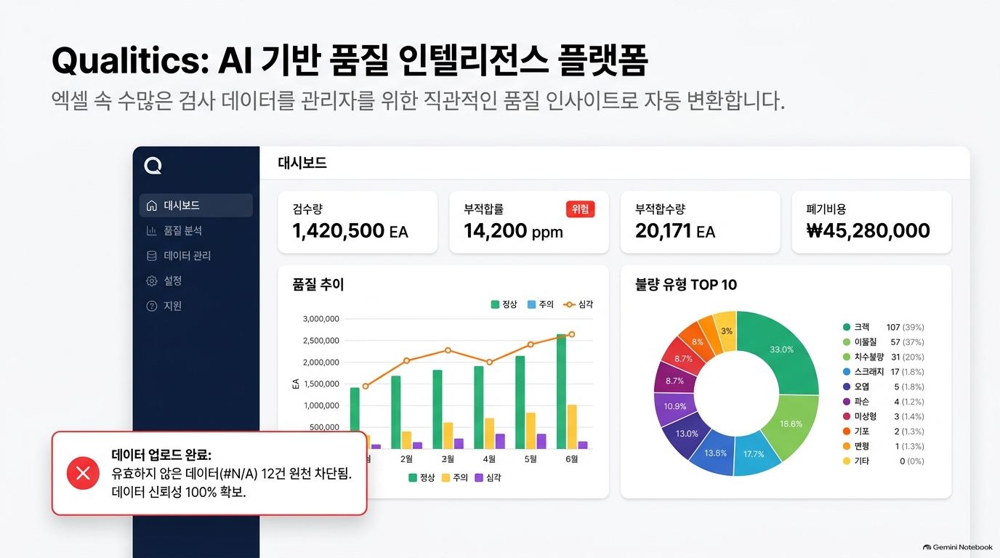
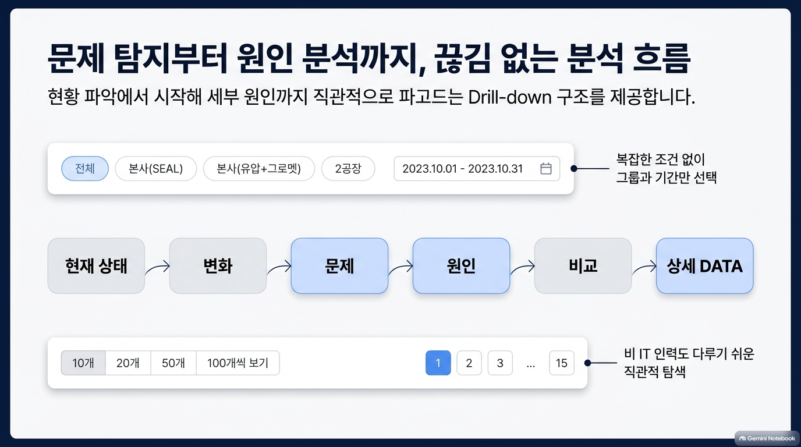
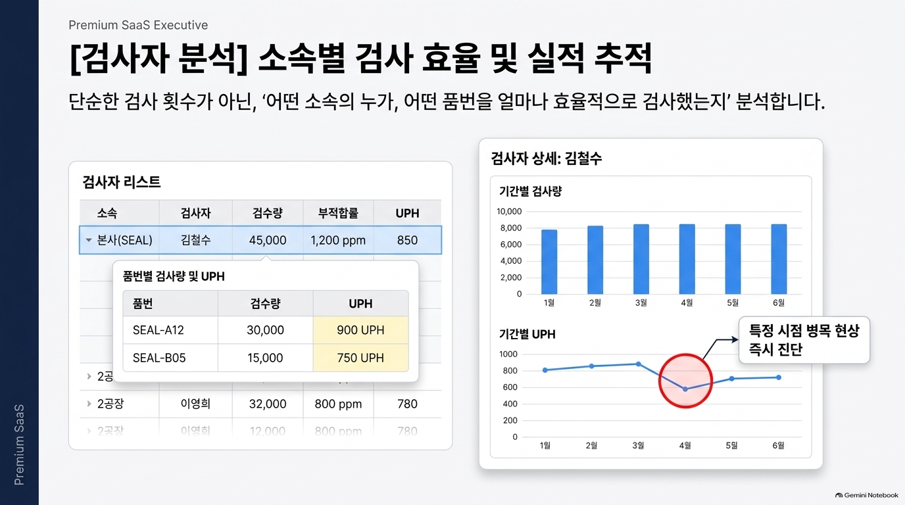
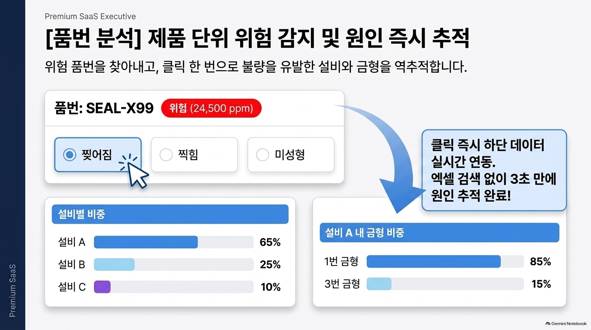
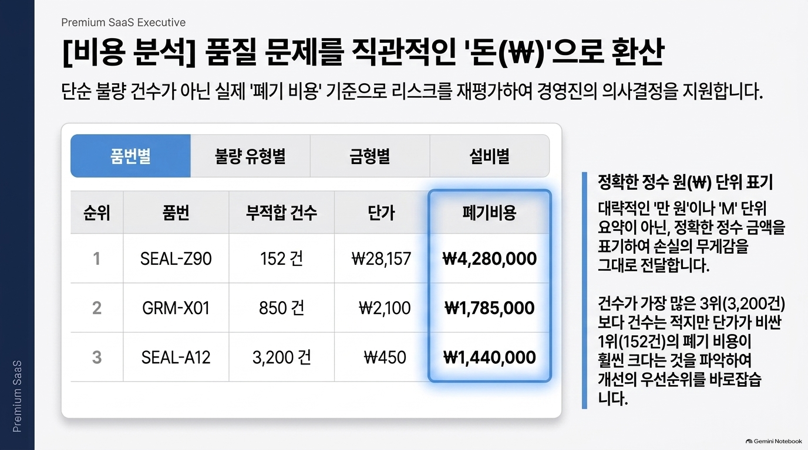
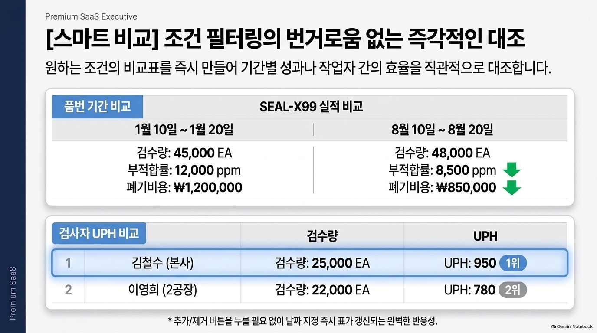
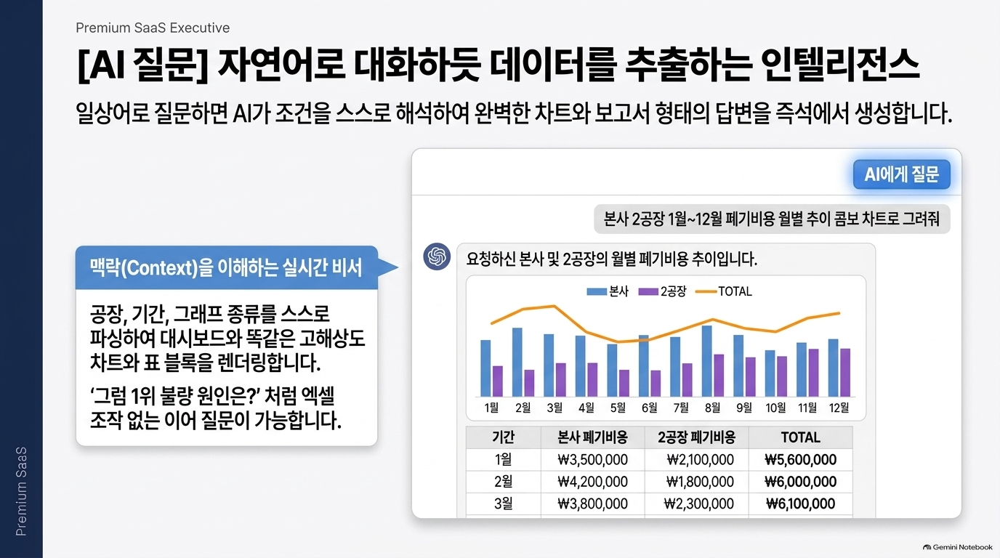
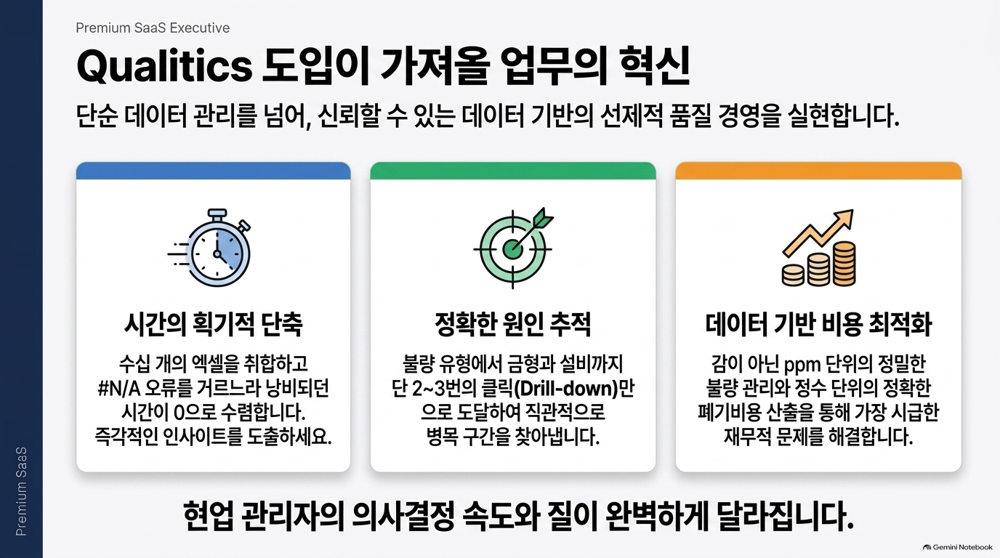
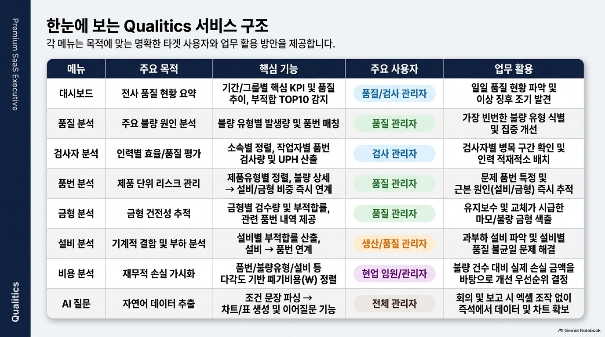

# Qualitics

**Hyundacorp 검사 DATA를 위한 AI 기반 품질 인텔리전스 플랫폼**

엑셀 속 수많은 검사 데이터를, 관리자를 위한 직관적인 품질 인사이트로 자동 변환합니다.
상단 Hyundai/Hyundacorp 브랜딩 아래에서 분석 메뉴, 데이터 업로드, 설정(테마·관리자 모드), AI 챗봇을 한 번에 이용할 수 있습니다.

<p align="center">
  
</p>

---

## 한눈에 보기

| | |
| --- | --- |
| **목적** | 근무일지·검사 Excel을 업로드하면 검증·집계·분석까지 한 번에 |
| **주요 사용자** | 검사관리자 · 품질관리자 · 현장 책임자 |
| **분석 그룹** | 전체 · 본사(SEAL) · 본사(GROMMET) · 2공장 |
| **핵심 지표** | 검수량 · 부적합률(ppm) · 부적합수량 · 폐기비용(원) · UPH |

---

## 시작하기

### 요구 사항

- Node.js 20.19+ 또는 22.12+ (Vite 8 요구사항)
- npm

### 실행

```bash
npm install
npm run dev
```

브라우저에서 안내되는 로컬 주소(보통 `http://localhost:5173`)로 접속합니다.  
개발 서버 실행은 로컬에서 직접 해 주세요.

### 관리자 모드 환경변수 (선택·배포 시 권장)

검사 DATA **수정**·변경 이력을 쓰려면 서버에 아래를 설정합니다. (분석·업로드·AI 자체는 환경변수 없이 동작)

| 변수 | 설명 |
| --- | --- |
| `ADMIN_PASSWORD_HASH` | `npm run admin:hash -- "비밀번호"`로 생성한 scrypt 해시 |
| `ADMIN_SESSION_SECRET` | 세션 쿠키 서명용 비밀값 (배포 환경에서 필수) |

로컬은 `.env.local`에 둘 수 있습니다. **평문 비밀번호를 커밋하지 마세요.**

### 기타 명령

```bash
npm run build              # 관리자 API 번들 + 프로덕션 빌드
npm run preview            # 빌드 결과 미리보기
npm run lint               # 린트
npm run admin:hash -- "비밀번호"   # ADMIN_PASSWORD_HASH 생성
```

---

## 분석 흐름

문제 탐지부터 원인 분석까지, **끊김 없는 Drill-down** 구조를 제공합니다.  
복잡한 조건 없이 **분석 그룹 + 기간**만 선택하면 탐색을 시작할 수 있습니다.

<p align="center">
  
</p>

**현재 상태 → 변화 → 문제 → 원인 → 비교 → 상세 DATA**

---

## 주요 기능

### 1. 대시보드

전사 품질 현황을 KPI·그룹 비교·추이·설비 히트맵·품번 TOP으로 요약합니다.

- 검수량 / 부적합률 / 부적합수량 / 폐기비용
- **분석 그룹 비교 + 품질 추이** 연결 카드 (행·비중 클릭으로 그룹 전환, 짧은 전환 모달)
- **설비 × 불량 유형 히트맵** (행·열 합계, 1공장/2공장 소계 · **미지정은 소계 제외·전체 합계 포함**)
- **품번 기준 불량 TOP 10** 가로 순위 (정렬: 부적합수량·부적합률·검수량·폐기비용)
- 업로드 시 `#N/A` 등 오류 데이터 원천 차단으로 신뢰성 확보

### 2. 검사자 분석

「누가, 어느 소속에서, 어떤 품번을, 얼마나 효율적으로」 검사했는지 추적합니다.

<p align="center">
  
</p>

- 소속별 검수량 · 부적합률 · UPH
- **검수량 TOP 10** — 소속·제품유형 필터를 행으로 분리한 칩 UI
- 품번별 검사량·UPH 드릴다운
- 기간별 추이로 병목 시점 즉시 진단
- 상세에서 **돌아가기** 시 **페이지·검색·정렬** 유지
- 품번 상세에서 들어온 경우 **돌아가기에 해당 품번** 표시 · 품번 상세로 복귀

### 3. 품번 분석

위험 품번을 찾아내고, 클릭 한 번으로 설비·금형까지 역추적합니다.

<p align="center">
  
</p>

- 품번 상태(위험/주의/정상) · 부적합률(ppm)
- **불량 유형별 발생량** 원형(도넛) — 품질 분석과 동일 색상 · 조각 라벨 없이 우측 목록
- 불량 유형 선택 → 설비별 비중 → 설비 내 금형 비중 (선택 유형에 맞춰 **패널 테두리 색** 강조)
- 작업자·검사자명 클릭 시 상세로 이동 (`?product=`로 품번 전달)
- 상세 추이에서 **검수량/폐기비용 막대 + 부적합률(ppm) 선**을 한 차트로 비교
- 3개 이상의 달에 걸친 조회는 월별, 그 미만은 일별로 자동 집계
- 폐기비용은 `만`/M으로 축약하지 않고 `4,010,000원`처럼 전체 금액 표시
- Excel 검색 없이 원인 추적
- 상세 복귀 시 **제품유형 필터·페이지·검색·정렬** 유지

### 4. 비용 분석

품질 문제를 직관적인 **돈(₩)**으로 환산해 개선 우선순위를 재정렬합니다.

<p align="center">
  
</p>

- **폐기비용 품번 TOP 10** (제품유형 탭 · 가로 순위/막대 · 품번 상세 연동)
- 품번 / 불량 유형 / 금형 / 설비 / 검사자 / 분석 그룹 기준 폐기비용
- 건수만이 아니라 **실손실 금액**으로 판단
- 원 단위 정수 표기(요약 단위로 손실 무게를 희석하지 않음)

### 5. 스마트 비교

조건 필터 고민 없이, 원하는 조건의 비교표를 즉시 만듭니다.

<p align="center">
  
</p>

- **품번 기간 비교** — 기간 A vs B (검수량 · 부적합률 · 폐기비용)
- **검사자 UPH 비교** — 소속·검수량·UPH 순위
- 날짜 선택 즉시 표 갱신

### 5-1. 성형작업자 · 설비 · 금형

- **성형작업자 분석** — 부적합수량 작업자 TOP 10, 작업자명 클릭 시 상세로 이동 (목록 행 펼침 없음)
- **작업자 상세** — 품번 상세에서 진입 시 **돌아가기에 품번** 표시 · 품번 상세로 복귀
- **설비 분석** — 설비 × 불량 유형 히트맵 + 설비→품번 목록 (미지정은 소계 제외·전체 합계 포함)
- **금형 분석** — 금형별 검수량·부적합률·폐기비용 (최근 변화 열 없음)

### 6. AI 챗봇

외부 LLM 호출 없이 브라우저의 규칙 기반 분석기가 자연어 조건을 해석해 데이터를 추출합니다.

<p align="center">
  
</p>

- 공장·기간·그래프 유형을 문장에서 자동 해석
- 대시보드와 동일한 고해상도 차트·표 블록으로 답변
- 「방금 결과에서 1위 불량 원인은?」처럼 이전 결과를 명시한 **이어 질문** 지원
- 화면 우측 하단 **AI 챗봇 버튼**에서 독립 팝업으로 실행
- 팝업 대화·이어 질문 컨텍스트를 `localStorage`에 저장하여 다시 열어도 복원
- 첫 질문에 기간이 없으면 업로드된 유효 DATA의 **전체 기간**을 조회
- `방금`·`직전`·`이전`·`위 결과`·`그 품번`·`다시 조회` 등 명시적 표현이 있을 때만 직전 결과 연계
- 명시적 연계 표현이 없으면 유사한 질문도 항상 새로운 조회로 처리
- 「지난달」「이번 달」「7월 22일~28일」「5월~7월」 등 자연어 기간 지원
- 좁은 챗봇 창에서도 막대·도넛 차트의 축·라벨·크기를 자동 조정

### 7. 주간업무 보고

관리자용 주간 품질·부적합 보고 화면입니다.

- 최근 12개월 월별 추세 + 주간 상세(단일 페이지)
- 주차 모드 / **사용자 지정 기간**
- 주간 생산·검사 실적, ISSUE, 조직별 부적합 WORST 5
- 조회 조건 URL·localStorage 유지 (품번 상세 복귀 시에도 기간 복원)

### 8. 데이터 관리

Excel 업로드 → 헤더 자동 인식 → 검증 → 저장.

- 업로드 화면 **공지**: MES 최종검사일지현황 데이터 업로드 안내
- `#N/A`·제품유형 누락 등은 오류로 차단 → **오류 DATA** 메뉴에서 확인
- 소속 정규화(예: `구지공장` → `2공장`)
- 제품유형 정규화(예: `유압` → `GROMMET`)
- 근무일지 실제 컬럼명 별칭 지원

### 8-1. 검사 DATA · 오류 DATA · 관리자 모드

- **검사 DATA** — 정상·경고 행 조회·검색·Excel 다운로드 (전역 필터 없음)
- **오류 DATA** — 오류 행 전용 목록 (더보기 > Insight)
- **설정** — 화면 모드(라이트/다크) + **관리자 모드** 로그인
- 관리자만 행 더블클릭/수정 버튼으로 편집 가능 · **수정 사유 필수** · 재검증 후 상태에 따라 메뉴 간 이동
- 관리자 **변경 이력** (서버 API) · 세션 쿠키(유휴 30분 / 절대 8시간)

### 9. 조회 상태·반응형 UX

- **분석 목록 상태 유지** — 검사자·품번·품질 분석의 검색·정렬·페이지(·유형 필터)를 세션에 저장해 상세에서 돌아와도 복원
- **전역 필터 유지** — 분석 그룹·기간을 세션에 저장 (데이터 초기화·재업로드 시 함께 초기화)
- **반응형 상단 내비게이션** — 화면 폭에 맞춰 주요 메뉴를 자동 배치하고 나머지는 **더보기**에 수용
- **설정 모달** — 테마·관리자 모드 통합 (헤더 단독 테마 토글 없음)
- **반응형 차트·그리드** — KPI·카드 자동 열 배치, AI 차트 라벨 최적화
- **다크 모드 가독성** — 주간 보고 선택 열·현재 행, 입력창, 차트 축·범례·툴팁까지 테마 대응

---

## 도입 효과

<p align="center">
  
</p>

| 축 | 내용 |
| --- | --- |
| **시간 단축** | 수십 개 Excel 취합·`#N/A` 필터링 수작업 → 즉시 인사이트 |
| **원인 추적** | 불량 유형 → 금형·설비까지 2~3클릭 · 작업자/검사자 상세까지 연결 |
| **비용 최적화** | ppm 단위 관리 + 정확한 폐기비용으로 긴급 손실 우선 대응 |

> 현업 관리자의 의사결정 속도와 질이 달라집니다.

---

## 서비스 구조

각 메뉴는 목적에 맞는 사용자와 업무 활용 방안을 제공합니다.

<p align="center">
  
</p>

| 메뉴 | 주요 목적 | 핵심 기능 | 주요 사용자 |
| --- | --- | --- | --- |
| 대시보드 | 전사 품질 현황 요약 | KPI, 그룹비교+추이, 설비×불량 히트맵(미지정=합계만), 품번 TOP | 품질·검사관리자 |
| 품질 분석 | 불량 주원인 파악 | 유형별 발생량·품번 매칭 · 선택상태 유지 | 품질관리자 |
| 검사자 분석 | 인력 효율·품질 평가 | 검수량 TOP(소속·유형) · 상세 복귀 · 품번에서 오면 품번 복귀 | 검사관리자 |
| 품번 분석 | 제품 단위 위험 관리 | 도넛·불량→설비·금형 · 작업자/검사자 상세 링크 · 목록 조건 유지 | 품질관리자 |
| 금형 분석 | 금형 상태 추적 | 검수량·부적합률·폐기비용 | 품질관리자 |
| 설비 분석 | 설비 불량·부하 분석 | 설비×불량 히트맵 · 설비별 부적합률·품번 | 생산·품질관리자 |
| 비용 분석 | 재무적 손실 가시화 | 폐기비용 품번 TOP · 다차원 폐기비용(원) | 현장 책임자 |
| 성형작업자 분석 | 성형 실적·부적합 | 부적합수량 TOP · 작업자 상세(·품번 복귀) | 생산·품질관리자 |
| AI 챗봇 | 자연어 데이터 추출 | 독립 팝업·대화 저장·조건 해석·반응형 차트/표·이어질문 | 전 관리자 |
| 주간업무 보고 | 주간 품질 보고 | 월·주·WORST 5·ISSUE | 품질·검사관리자 |
| 스마트 비교 | 조건별 즉시 비교 | 품번 기간 비교 · 검사자 UPH | 품질·검사관리자 |
| 검사 DATA | 원본 검사 이력 조회 | 정상·경고 검색·정렬·Excel · (관리자) 수정·변경 이력 | 검사·품질관리자 |
| 오류 DATA | 오류 행 점검·수정 | 오류 전용 목록 · (관리자) 재검증 후 검사 DATA 이동 | 검사·품질관리자 |
| 데이터 업로드 | Excel 검증·반영 | MES 공지·헤더 자동 인식·오류 제외·경고 확인 | 검사관리자 |
| 데이터 품질 | 업로드 품질 점검 | 정상·경고·오류·제외 집계와 이슈 행 | 검사관리자 |
| 설정 | 테마·권한 | 라이트/다크 · 관리자 로그인 | 전 사용자 / 관리자 |

---

## 데이터 처리와 저장

- Excel 파싱·집계·AI 질의는 **브라우저**에서 처리합니다. (외부 LLM 불필요)
- 업로드 데이터는 `localStorage`의 `inspection-analytics-records`에 저장하고, 없으면 번들 시드 데이터로 시작합니다.
- 전역 필터·일부 목록 조회 상태는 `sessionStorage`, 테마·AI 팝업 대화·주간 보고 설정은 `localStorage`에 보관합니다.
- **관리자 로그인·변경 이력**만 서버 API(`/api/admin/*`, `/api/inspection-data/*`)를 사용합니다. 로컬은 Vite 플러그인, 배포는 Vercel Serverless입니다.
- 브라우저 저장 공간이 부족하면 현재 메모리 분석은 유지되지만 새로고침 후 시드 데이터로 돌아갈 수 있습니다.
- 분석·조회만 쓸 때는 환경변수가 없어도 됩니다. 관리자 수정 기능을 쓰려면 `ADMIN_PASSWORD_HASH`·`ADMIN_SESSION_SECRET`이 필요합니다.

배포 빌드 결과는 `dist`에 생성되며, `vercel.json`이 SPA 라우팅과 관리자 API를 연결합니다.

---

## 기술 스택

| 구분 | 기술 |
| --- | --- |
| UI | React 19, TypeScript 6, Vite 8 |
| 스타일 | Tailwind CSS 4 |
| 차트 | Recharts |
| 라우팅 | React Router |
| Excel | SheetJS (`xlsx`) |
| 아이콘 | Lucide React |
| 관리자 API | Vite 플러그인(로컬) · Vercel Serverless(배포) · scrypt 비밀번호 · HttpOnly 세션 |

---

## 문서

- [화면설계서](./화면설계서.md) — UI/UX·화면·지표·메뉴 명세 (최신 V31)

---

## 라이선스

Private — 내부용 프로젝트입니다.
